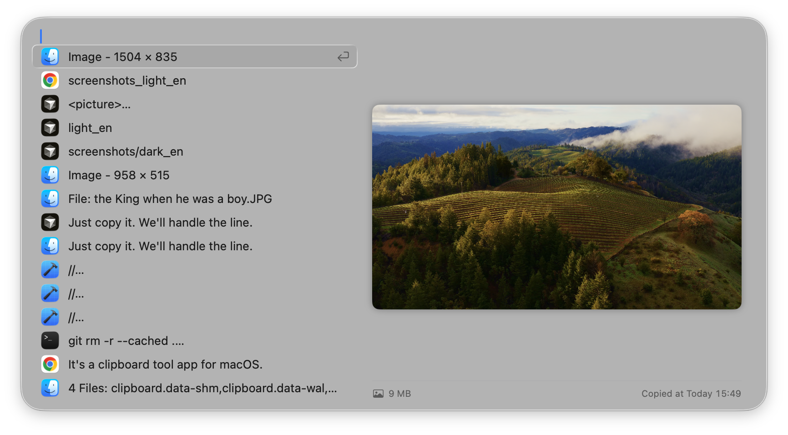

	

> Just copy it. We'll handle the line.

<picture>
 <source media="(prefers-color-scheme: dark)" srcset="docs/screenshots_dark_en.png">
 <source media="(prefers-color-scheme: light)" srcset="docs/screenshots_light_en.png">
 
</picture>

**Requirements**: macOS 26.0+
<small>Why? Because we use liquid glass APIs like `glassEffect`. We don't look back.</small>

## Features
It records your clipboard. <small>（Specifically, go explore yourself）</small>

## 🚧 Roadmap

- [ ] Pinboard 
- [ ] Pinboard Preferences